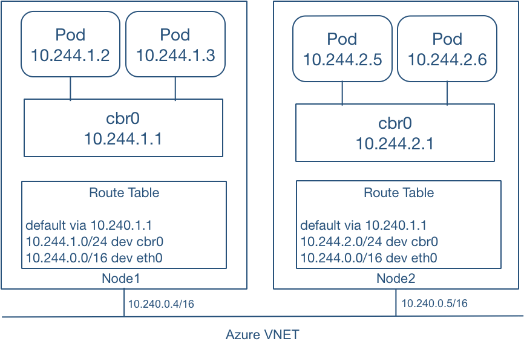
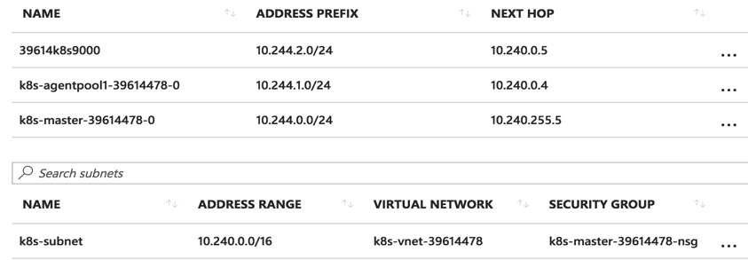

# Kubernetes 网络模型

## 网络模型

- IP-per-Pod，每个 Pod 都拥有一个独立 IP 地址，Pod 内所有容器共享一个网络命名空间
- 集群内所有 Pod 都在一个直接连通的扁平网络中，可通过 IP 直接访问
  - 所有容器之间无需 NAT 就可以直接互相访问
  - 所有 Node 和所有容器之间无需 NAT 就可以直接互相访问
  - 容器自己看到的 IP 跟其他容器看到的一样
- Service cluster IP 尽可在集群内部访问，外部请求需要通过 NodePort、LoadBalance 或者 Ingress 来访问

## 官方插件

目前，Kubernetes 支持以下两种插件：

* kubenet：这是一个基于 CNI bridge 的网络插件（在 bridge 插件的基础上扩展了 port mapping 和 traffic shaping ），是目前推荐的默认插件
* CNI：CNI 网络插件，需要用户将网络配置放到 `/etc/cni/net.d` 目录中，并将 CNI 插件的二进制文件放入 `/opt/cni/bin`
* ~~exec：通过第三方的可执行文件来为容器配置网络，已在 v1.6 中移除，见 [kubernetes#39254](https://github.com/kubernetes/kubernetes/pull/39254)~~

## kubenet

kubenet 是一个基于 CNI bridge 的网络插件，它为每个容器建立一对 veth pair 并连接到 cbr0 网桥上。kubenet 在 bridge 插件的基础上拓展了很多功能，包括

- 使用 host-local IPAM 插件为容器分配 IP 地址， 并定期释放已分配但未使用的 IP 地址

- 设置 sysctl `net.bridge.bridge-nf-call-iptables = 1`

- 为 Pod IP 创建 SNAT 规则

  - `-A POSTROUTING ! -d 10.0.0.0/8 -m comment --comment "kubenet: SNAT for outbound traffic from cluster" -m addrtype ! --dst-type LOCAL -j MASQUERADE`

- 开启网桥的 hairpin 和 promisc 模式，允许 Pod 访问它自己所在的 Service IP（即通过 NAT 后再访问 Pod 自己）

  ```sh
  -A OUTPUT -j KUBE-DEDUP
  -A KUBE-DEDUP -p IPv4 -s a:58:a:f4:2:1 -o veth+ --ip-src 10.244.2.1 -j ACCEPT
  -A KUBE-DEDUP -p IPv4 -s a:58:a:f4:2:1 -o veth+ --ip-src 10.244.2.0/24 -j DROP
  ```

- HostPort 管理以及设置端口映射

- Traffic shaping，支持通过 `kubernetes.io/ingress-bandwidth` 和 `kubernetes.io/egress-bandwidth` 等 Annotation 设置 Pod 网络带宽限制

下图是一个 Kubernetes on Azure 多节点的 Pod 之间相互通信的原理：



跨节点 Pod 之间相互通信时，会通过云平台或者交换机配置的路由转发到正确的节点中：




未来 kubenet 插件会迁移到标准的 CNI 插件（如 ptp），具体计划见 [这里](https://docs.google.com/document/d/1glJLMHrE2eqwRrAN4fdsz4Vg3R1Iqt6bm5GJQ4GdjlQ/edit#)。

## CNI plugin

安装 CNI：

```sh
cat <<EOF> /etc/yum.repos.d/kubernetes.repo
[kubernetes]
name=Kubernetes
baseurl=http://yum.kubernetes.io/repos/kubernetes-el7-x86_64
enabled=1
gpgcheck=1
repo_gpgcheck=1
gpgkey=https://packages.cloud.google.com/yum/doc/yum-key.gpg
       https://packages.cloud.google.com/yum/doc/rpm-package-key.gpg
EOF

yum install -y kubernetes-cni
```

配置 CNI brige 插件：

```sh
    mkdir -p /etc/cni/net.d
cat >/etc/cni/net.d/10-mynet.conf <<-EOF
{
    "cniVersion": "0.3.0",
    "name": "mynet",
    "type": "bridge",
    "bridge": "cni0",
    "isGateway": true,
    "ipMasq": true,
    "ipam": {
        "type": "host-local",
        "subnet": "10.244.0.0/16",
        "routes": [
            {"dst": "0.0.0.0/0"}
        ]
    }
}
EOF
cat >/etc/cni/net.d/99-loopback.conf <<-EOF
{
    "cniVersion": "0.3.0",
    "type": "loopback"
}
EOF
```

更多 CNI 网络插件的说明请参考 [CNI 网络插件](cni/index.md)。

## [Flannel](flannel/index.md)

[Flannel](https://github.com/coreos/flannel/blob/master/Documentation/kube-flannel.yml) 是一个为 Kubernetes 提供 overlay network 的网络插件，它基于 Linux TUN/TAP，使用 UDP 封装 IP 包来创建 overlay 网络，并借助 etcd 维护网络的分配情况。

```sh
kubectl create -f https://github.com/coreos/flannel/raw/master/Documentation/kube-flannel-rbac.yml
kubectl create -f https://github.com/coreos/flannel/raw/master/Documentation/kube-flannel.yml
```

## [Weave Net](weave/index.md)

Weave Net 是一个多主机容器网络方案，支持去中心化的控制平面，各个 host 上的 wRouter 间通过建立 Full Mesh 的 TCP 链接，并通过 Gossip 来同步控制信息。这种方式省去了集中式的 K/V Store，能够在一定程度上减低部署的复杂性，Weave 将其称为 “data centric”，而非 RAFT 或者 Paxos 的 “algorithm centric”。

数据平面上，Weave 通过 UDP 封装实现 L2 Overlay，封装支持两种模式，一种是运行在 user space 的 sleeve mode，另一种是运行在 kernal space 的 fastpath mode。Sleeve mode 通过 pcap 设备在 Linux bridge 上截获数据包并由 wRouter 完成 UDP 封装，支持对 L2 traffic 进行加密，还支持 Partial Connection，但是性能损失明显。Fastpath mode 即通过 OVS 的 odp 封装 VxLAN 并完成转发，wRouter 不直接参与转发，而是通过下发 odp 流表的方式控制转发，这种方式可以明显地提升吞吐量，但是不支持加密等高级功能。

```sh
kubectl apply -f https://git.io/weave-kube
```

## [Calico](calico/index.md)

[Calico](https://www.projectcalico.org/) 是一个基于 BGP 的纯三层的数据中心网络方案（不需要 Overlay），并且与 OpenStack、Kubernetes、AWS、GCE 等 IaaS 和容器平台都有良好的集成。

Calico 在每一个计算节点利用 Linux Kernel 实现了一个高效的 vRouter 来负责数据转发，而每个 vRouter 通过 BGP 协议负责把自己上运行的 workload 的路由信息像整个 Calico 网络内传播——小规模部署可以直接互联，大规模下可通过指定的 BGP route reflector 来完成。 这样保证最终所有的 workload 之间的数据流量都是通过 IP 路由的方式完成互联的。Calico 节点组网可以直接利用数据中心的网络结构（无论是 L2 或者 L3），不需要额外的 NAT，隧道或者 Overlay Network。

此外，Calico 基于 iptables 还提供了丰富而灵活的网络 Policy，保证通过各个节点上的 ACLs 来提供 Workload 的多租户隔离、安全组以及其他可达性限制等功能。

```sh
kubectl apply -f http://docs.projectcalico.org/v2.1/getting-started/kubernetes/installation/hosted/kubeadm/1.6/calico.yaml
```

## OVS

<https://kubernetes.io/docs/admin/ovs-networking/> 提供了一种简单的基于 OVS 的网络配置方法：

- 每台机器创建一个 Linux 网桥 kbr0，并配置 docker 使用该网桥（而不是默认的 docker0），其子网为 10.244.x.0/24
- 每台机器创建一个 OVS 网桥 obr0，通过 veth pair 连接 kbr0 并通过 GRE 将所有机器互联
- 开启 STP
- 路由 10.244.0.0/16 到 OVS 隧道


## [OVN](ovn-kubernetes.md)

[OVN (Open Virtual Network)](http://openvswitch.org/support/dist-docs/ovn-architecture.7.html) 是 OVS 提供的原生虚拟化网络方案，旨在解决传统 SDN 架构（比如 Neutron DVR）的性能问题。

OVN 为 Kubernetes 提供了两种网络方案：

* Overaly: 通过 ovs overlay 连接容器
* Underlay: 将 VM 内的容器连到 VM 所在的相同网络（开发中）

其中，容器网络的配置是通过 OVN 的 CNI 插件来实现。

## [Contiv](contiv/index.md)

[Contiv](http://contiv.github.io) 是思科开源的容器网络方案，主要提供基于 Policy 的网络管理，并与主流容器编排系统集成。Contiv 最主要的优势是直接提供了多租户网络，并支持 L2(VLAN), L3(BGP), Overlay (VXLAN) 以及思科自家的 ACI。

## [Romana](romana/index.md)

Romana 是 Panic Networks 在 2016 年提出的开源项目，旨在借鉴 route aggregation 的思路来解决 Overlay 方案给网络带来的开销。

## [OpenContrail](opencontrail/index.md)

OpenContrail 是 Juniper 推出的开源网络虚拟化平台，其商业版本为 Contrail。其主要由控制器和 vRouter 组成：

* 控制器提供虚拟网络的配置、控制和分析功能
* vRouter 提供分布式路由，负责虚拟路由器、虚拟网络的建立以及数据转发

其中，vRouter 支持三种模式

* Kernel vRouter：类似于 ovs 内核模块
* DPDK vRouter：类似于 ovs-dpdk
* Netronome Agilio Solution (商业产品)：支持 DPDK, SR-IOV and Express Virtio (XVIO)

[Juniper/contrail-kubernetes](https://github.com/Juniper/contrail-kubernetes) 提供了 Kubernetes 的集成，包括两部分：

* kubelet network plugin 基于 kubernetes v1.6 已经删除的 [exec network plugin](https://github.com/kubernetes/kubernetes/pull/39254)
* kube-network-manager 监听 kubernetes API，并根据 label 信息来配置网络策略

## [Midonet](midonet/index.md)

[Midonet](https://www.midonet.org/) 是 Midokura 公司开源的 OpenStack 网络虚拟化方案。

- 从组件来看，Midonet 以 Zookeeper+Cassandra 构建分布式数据库存储 VPC 资源的状态——Network State DB Cluster，并将 controller 分布在转发设备（包括 vswitch 和 L3 Gateway）本地——Midolman（L3 Gateway 上还有 quagga bgpd），设备的转发则保留了 ovs kernel 作为 fast datapath。可以看到，Midonet 和 DragonFlow、OVN 一样，在架构的设计上都是沿着 OVS-Neutron-Agent 的思路，将 controller 分布到设备本地，并在 neutron plugin 和设备 agent 间嵌入自己的资源数据库作为 super controller。
- 从接口来看，NSDB 与 Neutron 间是 REST API，Midolman 与 NSDB 间是 RPC，这俩没什么好说的。Controller 的南向方面，Midolman 并没有用 OpenFlow 和 OVSDB，它干掉了 user space 中的 vswitchd 和 ovsdb-server，直接通过 linux netlink 机制操作 kernel space 中的 ovs datapath。

## Host network

最简单的网络模型就是让容器共享 Host 的 network namespace，使用宿主机的网络协议栈。这样，不需要额外的配置，容器就可以共享宿主的各种网络资源。

优点

- 简单，不需要任何额外配置
- 高效，没有 NAT 等额外的开销

缺点

- 没有任何的网络隔离
- 容器和 Host 的端口号容易冲突
- 容器内任何网络配置都会影响整个宿主机

> 注意：HostNetwork 是在 Pod 配置文件中设置的，kubelet 在启动时还是需要配置使用 CNI 或者 kubenet 插件（默认 kubenet）。

## 其他

### [ipvs](ipvs/index.md)

Kubernetes v1.8 已经支持 ipvs 负载均衡模式（alpha 版）。

### [Canal](https://github.com/tigera/canal)

[Canal](https://github.com/tigera/canal) 是 Flannel 和 Calico 联合发布的一个统一网络插件，提供 CNI 网络插件，并支持 network policy。

### [kuryr-kubernetes](https://github.com/openstack/kuryr-kubernetes)

[kuryr-kubernetes](https://github.com/openstack/kuryr-kubernetes) 是 OpenStack 推出的集成 Neutron 网络插件，主要包括 Controller 和 CNI 插件两部分，并且也提供基于 Neutron LBaaS 的 Service 集成。

### [Cilium](https://github.com/cilium/cilium)

[Cilium](https://github.com/cilium/cilium) 是一个基于 eBPF 和 XDP 的高性能容器网络方案，提供了 CNI 和 CNM 插件。

项目主页为 <https://github.com/cilium/cilium>。

### [kope](https://github.com/kopeio/kope-routing)

[kope](https://github.com/kopeio/kope-routing) 是一个旨在简化 Kubernetes 网络配置的项目，支持三种模式：

- Layer2：自动为每个 Node 配置路由
- Vxlan：为主机配置 vxlan 连接，并建立主机和 Pod 的连接（通过 vxlan interface 和 ARP entry）
- ipsec：加密链接

项目主页为 <https://github.com/kopeio/kope-routing>。

### [Kube-router](https://github.com/cloudnativelabs/kube-router)

[Kube-router](https://github.com/cloudnativelabs/kube-router) 是一个基于 BGP 的网络插件，并提供了可选的 ipvs 服务发现（替代 kube-proxy）以及网络策略功能。

部署 Kube-router：

```sh
kubectl apply -f https://raw.githubusercontent.com/cloudnativelabs/kube-router/master/daemonset/kubeadm-kuberouter.yaml
```

部署 Kube-router 并替换 kube-proxy（这个功能其实不需要了，kube-proxy 已经内置了 ipvs 模式的支持）：

```sh
kubectl apply -f https://raw.githubusercontent.com/cloudnativelabs/kube-router/master/daemonset/kubeadm-kuberouter-all-features.yaml
# Remove kube-proxy
kubectl -n kube-system delete ds kube-proxy
docker run --privileged --net=host gcr.io/google_containers/kube-proxy-amd64:v1.7.3 kube-proxy --cleanup-iptables
```